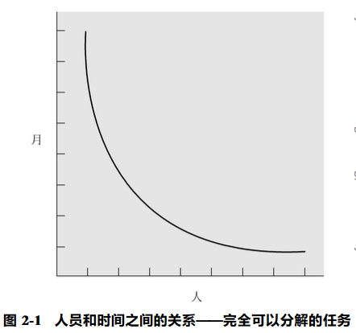
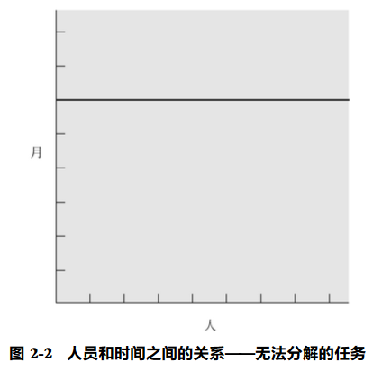
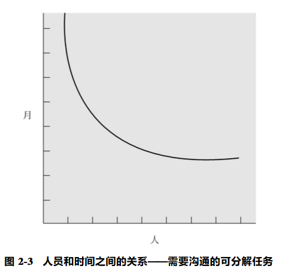
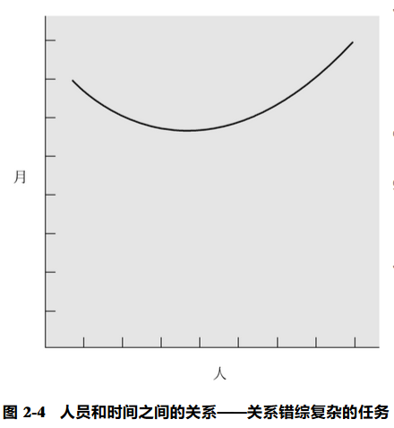

《人月神话》读书笔记（上）
<!-- more -->

最近在读的一本书是《人月神话》，由于同事买了这本书，所以打算在同事还没有看这本书计划的时候，先借来看完。现在看到了一半，对于本书内容有了大致了解，感觉可以在以后觉得有需要重读此书的时候，再买来看，毕竟是“软工圣经”。
***
闲话不多说，下面来写一下我目前看到前半部分的一点感触。

《人月神话》这是一本适用于软件开发人员、软件项目经理及系统分析师等 IT 从业者的经典之作。这是一本始发行于1975年的书，里面记载了一篇作者关于20周年纪念版的序言，里面写道“令我惊奇和高兴的是，《人月神话》在20多年后仍然继续流行”。可能作者也没有想到，在40多年后的今天，这本书依然被我们视为经典，广为流传。能做到如此这般，实属不易。我也很惊讶于这本40多年前的书中观点至今读来仍然能给我醍醐灌顶之感。

1. 关于职业乐趣
对于我来说，当前职业的乐趣是我能亲眼看到自己工作所带来的成果，能看到自己开发的东西对他人是有用的。而且这个职业是需要持续学习的，在自己去钻研，学习一些新东西的时候，我能明显的感觉到自己的成长，很充实。而不是选择去做一条咸鱼。

2. 关于职业苦恼
针对书中所提到的某些部分，还是有点感触。
“苦恼来自追求完美”。我对这条的感触是，总是感觉自己写的东西不好，在做某些东西的时候，经常会有一些疑惑，纠结。纠结于这样去写出的代码是不是不好，用另一种方式写会不会更好，纠结于某些处理方式，会不会有更优解。很多时候，自己没法做出判断，就选择了其中一种方式，但是就是觉得不完美。
“苦恼来自由他人设定目标、供给资源和提供信息”。我对这条的感触是，经常由于项目进度原因，某些功能本身预留时间就很紧迫，对于工期的报价不能单单针对功能去评估，这一点是我所左右不了的。

说起工期的估算，本书中讲到一些方面。

缺乏合理的进度安排是造成项目滞后的最主要原因，它比其他所有因素加起来的影响还大，导致这种灾难如此普遍的原因主要有以下5点：

1、对估算技术缺乏有效的研究，更严肃地说，它反映了一种悄无声息，但并不真实的假设——一切都将运作良好；

2、我们采用的估算技术隐含地假设人和月可以互换，错误地将工作进度与工作量相互混淆；

3、对于自己的估算缺乏信心，软件经理通常不会有耐心持续估算这项工作；

4、对进度缺少跟踪和监督；

5、当意识到进度的偏移时，下意识(以及传统)的反应是增加人力。
## 乐观主义
“计算机还很年轻，程序员更加年轻，而年轻人重视些乐观主义者——无论是什么样的程序，结果是毋庸置疑的：”这次它肯定会运行“，或者“我刚刚找出最后一个错误””。所以估算工期的背后，有一个错误的假设：一切都将运作良好，每一项任务仅花费它所“应该”花费的时间。
现实可能会像计划安排的那样顺利，但是大多数情况下，一切正常的概率非常小。
## 人月
人月是在估算和进度安排中使用的工作量单位。书中说“用人月作为衡量一项工作的规模是一个危险和带有欺骗性的神话。它暗示着人员数量和时间是可以相互替换的。”

书中说到几种观点：

1. 人数和时间的互换仅仅适用于某个任务可以分解给参与人员，并且他们之间不需要相互的交流，这在系统编程中几乎是不可能的。
  

2. 当任务由于次序上的限制不能分解时，人手的添加对进度没有帮助。
  

3. 对于可以分解，但子任务之间需要相互沟通和交流的任务，必须在计划工作中考虑沟通的工作量。因此，在相同人月的前提下，采用增加人手来减少时间得到的最好情况，还是比未调整前差一些。
  

4. 相互之间交流的情况更糟一些。如果任务的每个部分必须分别与其他部分单独协作，则工作量按照 n(n-1)/2 递增。所增加的用于沟通的工作量可能会完全抵消对原有任务分解所产生的作用。所以对于这种情况，添加更多的人手，实际上是延长了而不是缩短了时间进度。
  

## 重复产生的进度灾难
当一个软件项目落后于进度时，通常的做法是加派人手。这可能有所帮助，却可能无法解决问题。
Brools 法则：向进度落后的项目中增加人手，只会使进度更加落后。
这就是除去了神话色彩的人月。项目的时间依赖于顺序上的限制，人员的最大数量依赖于独立子任务的数量。

总之，缺乏合理的进度安排是造成项目之后的最主要原因，它比其他所有因素加起来的影响还要大。