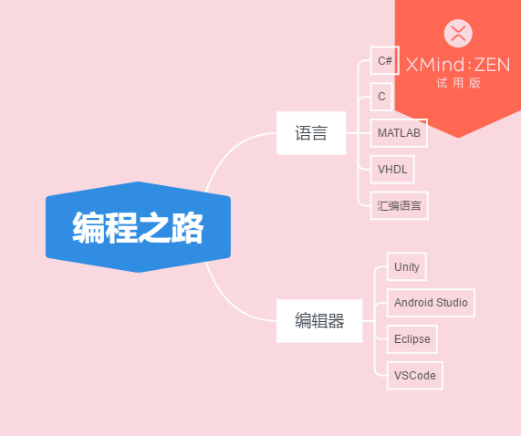

# 学习计划（2018.05.20）
## 一：已走过的路
（这部分将梳理、罗列我截止到目前已涉及到的知识。）  

脑图如下：
  

---
## 二：即将走的一段路
（这部分将列出接下来一段时间我将付诸行动的学习计划。）  

1. 基于 Unity
    * 1.1 AssetBundle
重要程度：⭐⭐⭐
（之前对 AssetBundle 的了解只到会降低包体，提高游戏运行流畅度而已，可以说是一点也不了解。不过这对于 Unity 来说是一项很重要的技术，任何 Unity 项目应该都会用到 AssetBundle，所以学习使用 AssetBundle 是必须的一项”具体技能“。现项目的 AssetBundle 系统是同事写的一套成熟系统，通过自己的自主学习和“找人指导”，再结合阅读现项目代码，实现逐步掌握。）
**具体实施计划：**
        * ① 阅读学习[马三小伙儿](http://www.cnblogs.com/msxh/p/8506274.html)博客所列学习链接（阅读、笔记）。（5.21-5.27）
            * 1.Unity AssetBundle5讲系列（2天）
            * 2.慕容小匹夫系列（2天）
            * 3.何三思译Unity AssetBundle官方文档系列（已读）
            * 5.Unity Assetbundles官方说明系列（已读）
            * 6.杂（3天）  

        * ② 看项目代码。
        * ③ 自己写个“质脆玩具”，去实践  。
2. Android Studio 基础学习
重要程度：⭐⭐
（最近在接 Android SDK，之前使用 Eclipse 接过 Misdas SDK 和 乐逗 SDK，现在改为使用 Android Studio，由于项目时间比较紧迫，直接就上手去接入新的 SDK，没有时间去研究这个编辑器的使用，都是遇到问题去网上搜索，所以需要去学习一下使用，便于后续接入 SDK。）
**具体实施计划：**
    * ①阅读学习[Studio教程](http://ask.android-studio.org/?/explore/category-studio)及[Gradle 教程](http://ask.android-studio.org/?/explore/category-gradle)  。（5.28-6.3）  

3. 基于计算机基础
重要程度：⭐
（由于我学的并不是计算机专业，所以关于计算机整个系统并不了解，计算机系统基础不好，心里一直对此“耿耿于怀”。鉴于此，要保持"空杯心态"，系上“白色腰带"打算从头开始学，从最基础开始学。但是这个学习并不是现阶段最急需汲取的知识，需要持续学习，所以重要程度不是那么高。）
**具体实施计划：**
    * ① 阅读《深入理解计算机系统》。（5.28-6.21）
共计722页，每天阅读30页，共计25天。

---
## 三：下一段路程
（这部分将列出计划学习，但是在上一部分还未安排时间的内容。）
1. Android 开发相关
2. GoLang 语言
3. 游戏编程相关书阅读

---
## 四：未来慢慢长路
（这部分将列出我理想达到的目标。）  

脚踏实地，学习一个“具体技能”就要去“深入挖掘”，不要只流于表面上的知识面。做到不断的“提高带宽”，不要只限于现阶段工作上需要的技能，先实现做一名合格 Unity 前端游戏开发工程师的目标。
